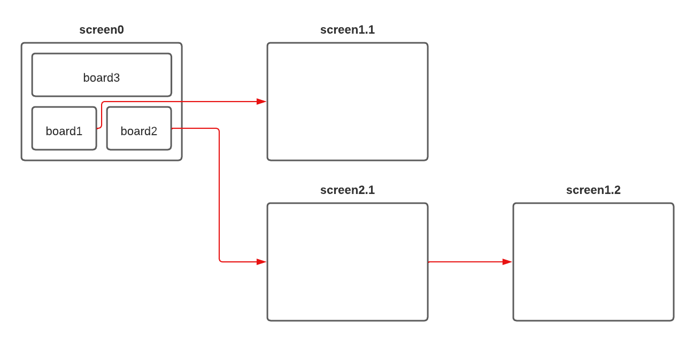

  

Périmètre de l’application - Ambula explorer
___

# Périmètre de l’application - Ambula explorer

*Fait le: 17/01/2023*

## V1
screen 0 (3 boards):

- lister les derniers blocs (**board 1**)
  - voir l’identifiant du bloc
  - voir son horodatage
  - voir son auteur
  - voir les rewards du bloc

- lister les dernières transactions (**board 2**)
  - voir l’identifiant de la transaction
  - voir son horodatage
  - voir l’adresse source et destination
  - voir les rewards de la transaction
  - voir le bloc rattaché

- lister des données globales (**board 3**)
  - valeur de la monnaie ??
  - nombre totale de transactions
  - nombre totale de blocs
  - dernière transaction terminé

## V2
- board 1
  - lien vers la liste des transactions d’un bloc (**screen 1.1**)

- board 2
  - lien vers le détail d’une adresse (**screen 2.1**)

- board 3
  - courbe du nombre de transaction sur les dernières semaines
  - courbe de la valeur de la monnaie sur les dernières semaines ?? 

- screen 1.1 (liste des transactions d’un bloc):
  - voir les données de bases d’une transaction
  - lien vers le détail d’une transaction (**screen 1.2**)

- screen 1.2 (détail d’une transaction)
  - voir les données de bases d’une transaction
  - …

- screen 2.1 (détail d’une adresse)
  - données de base d’une adresse ??
  - liste des transactions effectuées

## V3+
…

## Annexe
|  |
|:--:|
| <b>Parcours utilisateur - Ambula Explorer</b>|

